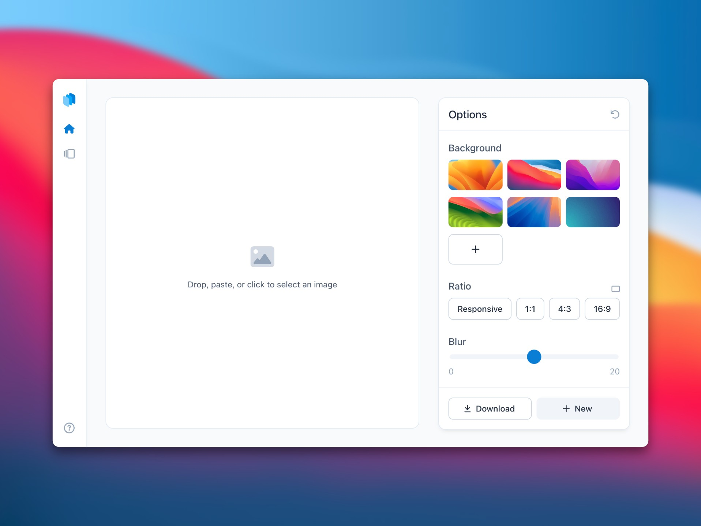
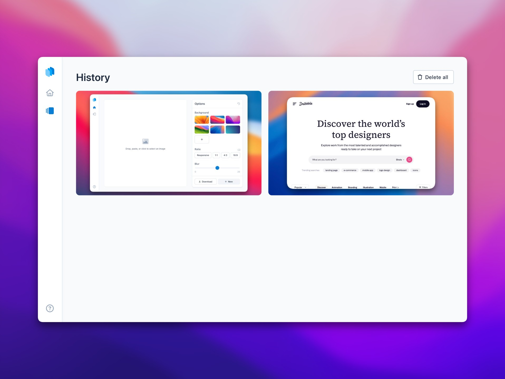

# Cappie

Transform your screenshots into vibrant and colorful product images. Registration-free, local-first, and super-fast.

## Screenshots

These two images show the Cappie user interface – and were produced with Cappie.

## Development

Clone the repository and run `npm install` and `npm run dev` for a local development environment.

## Contributing

Feel free to submit reasonable changes like bugfixes or functional additions. I will look into and test every contribution and will accept it in case it provides value for the general community. When you are planning to make an extensive contribution, please first discuss the change you wish to make by creating an issue.

## License

This project is licensed under the MIT License — see the [LICENSE.md](LICENSE.md) file for details.
